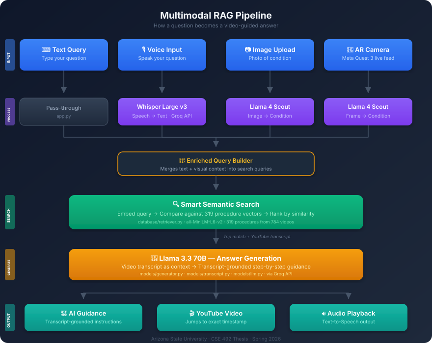

# MedVidQA — AI-Powered Medical Video Q&A System

<div align="center">

**Multimodal Medical Guidance with Voice, Vision, and Video**

[](https://www.python.org/downloads/)
[](https://flask.palletsprojects.com/)
[](https://groq.com/)
[](https://groq.com/)
[](https://groq.com/)
[](LICENSE)

_Arizona State University — CSE 492 Thesis Project — Spring 2026_

[Quick Start](#-quick-start) · [Features](#-features) · [Architecture](#-architecture) · [API Reference](#-api-reference) · [Dataset](#-dataset)

</div>

---

## 📖 About

MedVidQA is a **multimodal AI-powered medical question-answering system** that combines voice input, image recognition, and video retrieval to provide step-by-step medical procedure guidance. It is designed to support non-expert users — such as family caregivers and community health aides — during essential medical procedures.

The system is built on the **MedVidQA dataset** (TREC 2024) and uses a **Retrieval-Augmented Generation (RAG)** pipeline to deliver accurate, video-backed answers.

### Research Question

> How can AI-powered, multimodal question-answering systems be used through augmented reality to safely support non-expert users during essential medical procedures?

### Key Numbers

| Metric              | Value                               |
| ------------------- | ----------------------------------- |
| Medical Videos      | 784 verified YouTube videos         |
| Q&A Pairs           | 2,714 procedure questions           |
| Database Procedures | 319 verified, searchable procedures |
| Vision Model        | Llama 4 Scout 17B (Groq)            |
| Language Model      | Llama 3.3 70B (Groq)                |
| Voice Model         | Whisper Large v3 (Groq)             |

---

## ✨ Features

### Input Modalities

| Modality         | How It Works                                                                                                      |
| ---------------- | ----------------------------------------------------------------------------------------------------------------- |
| **Text**         | Type a medical question in the search box                                                                         |
| **Voice**        | Click the microphone button and speak your question. Uses browser Speech API with Whisper v3 server-side fallback |
| **Image**        | Upload a photo of a medical condition. Llama 4 Scout VLM identifies body part, condition, and severity            |
| **Camera Frame** | Send a live camera frame via API for real-time analysis (AR headset integration)                                  |

### Output

- **AI-Generated Guidance** — Calm, step-by-step instructions from Llama 3.3 70B
- **Video Playback** — Embedded YouTube player jumps to the exact relevant segment
- **Text-to-Speech** — Click the speaker icon to hear the guidance read aloud
- **Emergency Detection** — Automatically flags life-threatening conditions with 911 warnings

### Pipeline Highlights

- **Multi-Query Fusion RAG** — Combines multiple query variants with weighted scoring for better retrieval
- **Condition-Based Boosting** — When vision detects "fracture," fracture procedures are boosted and exercise videos are penalized
- **Body-Part Filtering** — Prevents hand injuries from matching foot procedures
- **Context-Aware Search** — Visual analysis enriches the text query before retrieval

---

## 🏗 Architecture

### System Flow

<p align="center">
  
</p>

### Which File Does What

| File                         | Role                                                         |
| ---------------------------- | ------------------------------------------------------------ |
| `app.py`                     | Flask server — receives requests, routes them, returns JSON  |
| `models/llm.py`              | Calls Groq API (Llama 3.3 for text, Whisper for voice)       |
| `models/image_recognizer.py` | Sends image to Llama 4 Scout VLM, gets body part + condition |
| `models/generator.py`        | Combines search results + LLM into a single response         |
| `database/retriever.py`      | Embeds queries, computes similarity, returns top procedures  |
| `database/medical_db.py`     | Loads procedures and embeddings from disk                    |
| `static/js/app.js`           | Frontend — voice recording, image upload, video player, TTS  |
| `templates/index_video.html` | The web page at localhost:8080                               |

---

## 🔧 Tech Stack

### Backend

| Package               | Purpose                         |
| --------------------- | ------------------------------- |
| Flask 3.0             | Web server and REST API         |
| Sentence Transformers | Semantic embedding for search   |
| Groq SDK              | LLM, VLM, and Whisper API calls |
| Pillow                | Image processing                |
| NumPy                 | Vector similarity computation   |
| PyYAML                | Configuration management        |

### Frontend

| Technology              | Purpose                               |
| ----------------------- | ------------------------------------- |
| HTML / CSS / JavaScript | Main web interface                    |
| Web Speech API          | Browser-native voice input and TTS    |
| YouTube IFrame API      | Video playback with timestamp control |

### AI Models (all via Groq — free tier)

| Model                                       | Role                   |
| ------------------------------------------- | ---------------------- |
| `llama-3.3-70b-versatile`                   | Answer generation      |
| `meta-llama/llama-4-scout-17b-16e-instruct` | Image analysis (VLM)   |
| `whisper-large-v3`                          | Voice transcription    |
| `all-MiniLM-L6-v2`                          | Text embedding (local) |

---

## 🚀 Quick Start

### Prerequisites

- Python 3.8 or higher
- A Groq API key (free at [console.groq.com/keys](https://console.groq.com/keys))

### Step 1 — Clone the Repository

```bash
git clone https://github.com/YB-Yottabyte/medical-video-qa.git
cd medical-video-qa
```

### Step 2 — Install Dependencies

```bash
pip install -r requirements.txt
```

### Step 3 — Add Your API Key

Open `config.yaml` and replace the Groq API key:

```yaml
ai:
  groq:
    api_key: "your-groq-api-key-here"
```

Or use an environment variable:

```bash
export GROQ_API_KEY="your-groq-api-key-here"
```

### Step 4 — Build the Database (first time only)

```bash
python scripts/build_database.py
```

This creates the embeddings cache in `data/cache_medvidqa_verified/`.

### Step 5 — Run the Server

```bash
python app.py
```

Open [http://localhost:8080](http://localhost:8080) in your browser.

### Quick Test

```bash
# Text query
curl -X POST http://localhost:8080/api/query_video \
  -H "Content-Type: application/json" \
  -d '{"query": "How to perform CPR?"}'

# Pipeline info
curl http://localhost:8080/api/pipeline_info
```

---

## ⚙️ Configuration

All settings are in `config.yaml`:

```yaml
ai:
  provider: groq # AI provider (groq / ollama / huggingface)
  groq:
    api_key: "your-key" # Get free at console.groq.com/keys
    model: llama-3.3-70b-versatile # Language model for answer generation
    temperature: 0.3 # Lower = more focused answers
    max_tokens: 1024 # Max response length

vision:
  clip_model: openai/clip-vit-base-patch32 # Legacy (not used in v2.0)
  top_k_matches: 5 # Number of image matches to return
  max_image_size: 10485760 # 10MB max upload size

database:
  embedding_model: all-MiniLM-L6-v2 # Sentence transformer model
  similarity_threshold: 0.3 # Minimum similarity score
  top_k: 5 # Number of procedures to retrieve

web:
  host: 0.0.0.0 # Listen on all interfaces
  port: 8080 # Server port
  debug: false # Flask debug mode
```

---

## 📡 API Reference

### Text Query

```
POST /api/query_video
Content-Type: application/json

{"query": "How to perform CPR on a child?"}
```

Returns: AI response + video ID + start/end timestamps + retrieved procedures.

### Image Query

```
POST /api/image_query
Content-Type: multipart/form-data

Field: image (file)
```

Returns: VLM analysis (body part, condition, severity) + matched procedure + video + AI guidance.

### Voice Transcription

```
POST /api/voice_transcribe
Content-Type: multipart/form-data

Field: audio (file — webm/wav/mp3)
```

Returns: Transcribed text (via Whisper Large v3).

### Camera Frame Analysis

```
POST /api/frame_analyze
Content-Type: application/json

{"frame_base64": "<base64-encoded-image>"}
```

Returns: Body part, condition, severity, matched procedure, confidence, latency.

### Multimodal Query (Combined)

```
POST /api/multimodal_query
Content-Type: multipart/form-data

Fields: query (text), audio (file), image (file)
```

Accepts any combination of text + voice + image. Returns enriched AI response with video.

### Health Check

```
GET /api/health
```

### Pipeline Info

```
GET /api/pipeline_info
```

Returns full system architecture details and supported endpoints.

---

## 📁 Project Structure

```
medical-video-qa/
│
├── app.py                          # Flask server — all API endpoints
├── config.yaml                     # System configuration
├── requirements.txt                # Python dependencies
├── README.md                       # This file
│
├── models/
│   ├── __init__.py
│   ├── llm.py                     # Groq AI handler (Llama 3.3)
│   ├── generator.py               # RAG response generator
│   └── image_recognizer.py        # Llama 4 Scout VLM image analysis
│
├── database/
│   ├── __init__.py
│   ├── medical_db.py              # Database loader and embedding storage
│   └── retriever.py               # Smart semantic retriever
│
├── static/
│   ├── css/styles.css             # Application styles
│   └── js/app.js                  # Frontend logic (voice, video, image)
│
├── templates/
│   └── index_video.html           # Main web interface
│
├── data/
│   ├── verified_medvidqa_videos.json    # 2,714 Q&A pairs from 784 videos
│   └── cache_medvidqa_verified/         # Pre-computed embeddings (319 procedures)
│
├── MedVidQA/
│   ├── train.json                 # Training split (2,710 entries)
│   ├── val.json                   # Validation split (145 entries)
│   └── test.json                  # Test split (155 entries)
│
└── scripts/
    ├── build_database.py          # Build embeddings cache
    ├── verify_all_videos.py       # Verify YouTube video availability
    └── update_system.py           # System update automation
```

---

## 📊 Dataset

### MedVidQA (TREC 2024)

The system is built on the [MedVidQA dataset](https://github.com/bbrfi/MedVidQA), a benchmark for medical video question answering.

| Split      | Entries   |
| ---------- | --------- |
| Train      | 2,710     |
| Validation | 145       |
| Test       | 155       |
| **Total**  | **3,010** |

After video verification: **784 available videos** with **2,714 valid Q&A pairs** and **319 unique searchable procedures**.

### Coverage Areas

- CPR and emergency response
- Wound care and bandaging
- Fracture splinting and first aid
- Physical therapy exercises
- Injection and medication administration
- Vital signs measurement
- Breathing techniques
- Surgical procedures (educational)

---

## 💡 Usage Examples

### Text Query

Type in the search box:

- "How to perform CPR on a child?"
- "How to splint a fractured hand?"
- "What is the Epley maneuver for vertigo?"

### Voice Query

1. Click the **microphone button** next to the text area
2. Speak your question clearly
3. The system transcribes and searches automatically

### Image Query

1. Click the **upload area** or drag and drop an image
2. Upload a photo of a medical condition (fracture, wound, burn, etc.)
3. Click **Get Answer**
4. The VLM identifies the condition and finds the matching procedure

### API Usage (for AR Integration)

```python
import requests, base64

# Send a camera frame for real-time analysis
with open("frame.jpg", "rb") as f:
    b64 = base64.b64encode(f.read()).decode()

response = requests.post("http://localhost:8080/api/frame_analyze", json={
    "frame_base64": b64
})

print(response.json())
# {"body_part": "Hand", "condition": "Fractures", "matched_procedure": "How do I splint a fractured hand?", ...}
```

---

## 🔍 Troubleshooting

| Issue                                      | Solution                                                                                                      |
| ------------------------------------------ | ------------------------------------------------------------------------------------------------------------- |
| **"Verified MedVidQA database not found"** | Run `python scripts/build_database.py` first                                                                  |
| **Groq API errors**                        | Check your API key in `config.yaml`. Get a free key at [console.groq.com/keys](https://console.groq.com/keys) |
| **Port 8080 in use**                       | Run `lsof -ti:8080 \| xargs kill -9` then restart                                                             |
| **Voice input not working**                | Use Chrome or Edge. Safari has limited Web Speech API support. The Whisper fallback activates automatically   |
| **Image recognition wrong match**          | The VLM works best with clear, well-lit medical images                                                        |
| **Slow first startup**                     | The embedding model downloads on first run (~90MB). Subsequent starts are fast                                |

---

## 🗺 Roadmap

- [x] Text-based medical Q&A with video retrieval
- [x] Image recognition with Llama 4 Scout VLM
- [x] Voice input (Web Speech API + Whisper fallback)
- [x] Smart semantic retrieval
- [x] Condition-based score boosting
- [x] Emergency detection and warnings
- [x] Text-to-speech output
- [x] Camera frame analysis API
- [x] Multimodal combined endpoint
- [ ] Meta Quest 3 AR headset integration (Unity)
- [ ] Offline procedure caching for low-connectivity
- [ ] Evaluation framework with task-based testing
- [ ] WebSocket streaming for real-time AR guidance

---

## 📄 License

This project is licensed under the MIT License. See [LICENSE](LICENSE) for details.

---

<div align="center">

**Arizona State University — CSE 492 Thesis — Spring 2026**

Sai Rithwik Kukunuri

_AI-Powered Multimodal Medical Video Q&A System_

</div>
